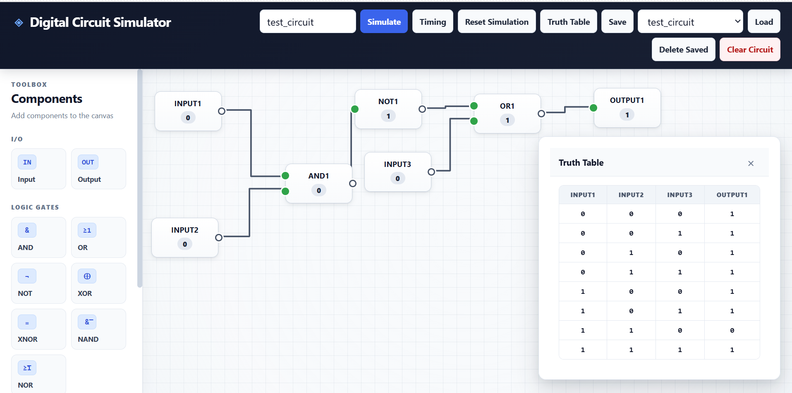
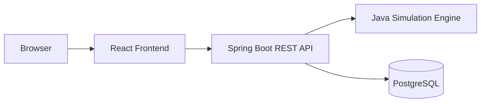

# Digital Circuit Simulator

An interactive full-stack digital logic circuit design and simulation platform built with Java, Spring Boot, React, PostgreSQL, and Docker.

Users can construct circuits visually, connect logic components, simulate outputs, generate truth tables, model propagation delays, inspect timing waveforms, and save circuits for later use.

## Live Demo

**[Launch Digital Circuit Simulator](https://powerful-creation-production-f466.up.railway.app)**

## Preview



## Features

- Interactive drag-and-drop circuit editor
- Input and output components
- AND, OR, NOT, XOR, XNOR, NAND, and NOR gates
- D flip-flop support for sequential circuits
- Visual wire connections between components
- Combinational circuit simulation
- Stateful sequential simulation
- Truth-table generation
- Per-gate propagation delays
- Event-driven timing simulation using a priority queue
- Timing waveform visualization
- Circuit save, load, update, and delete functionality
- PostgreSQL persistence
- Dockerized frontend and backend
- Production deployment on Railway

## Architecture



The application is divided into three main layers:

**Frontend** — React provides the interactive schematic editor, circuit controls, truth tables, and waveform visualization. Nginx serves the production build and proxies API requests to the backend.

**Backend** — Spring Boot exposes REST endpoints and connects the frontend to the Java simulation engine.

**Database** — PostgreSQL stores serialized circuit designs so circuits persist across sessions.

## Simulation Engine

The simulation engine models circuit components using an object-oriented Java hierarchy.

Each gate derives from a common component abstraction and evaluates its output based on connected input components.

For combinational circuits, the simulator analyzes component dependencies and evaluates the circuit in dependency order.

Sequential circuits introduce persistent state through D flip-flops and simulation sessions, allowing output state to carry across simulation requests.

## Event-Driven Timing Simulation

The simulator also models propagation delay.

Each gate has an associated delay in nanoseconds. Signal changes are represented as timestamped events and processed chronologically using a Java `PriorityQueue`.

When a component changes state:

1. Its new value is recorded.
2. Connected downstream components are evaluated.
3. New events are scheduled using the downstream component's propagation delay.
4. The resulting signal history is returned to the frontend.
5. React renders the signal histories as timing waveforms.

This allows the simulator to show not only the final logical result of a circuit, but also how signals propagate through it over time.

## Tech Stack

### Backend
- Java 17
- Spring Boot
- Spring Data JPA
- Maven
- JUnit

### Frontend
- React
- JavaScript
- HTML/CSS
- Vite
- Nginx

### Infrastructure
- PostgreSQL
- Docker
- Docker Compose
- Railway
- Git/GitHub

## Running Locally

### Prerequisites

Install:

- Java 17+
- Maven
- Node.js
- Docker

### Start PostgreSQL

From the repository root:

```bash
docker compose up -d postgres
```

### Start the Backend

```bash
mvn spring-boot:run
```

The backend runs locally at:

```text
http://localhost:8081
```

Test it with:

```text
http://localhost:8081/api/health
```

### Start the Frontend

In another terminal:

```bash
cd frontend
npm install
npm run dev
```

Open:

```text
http://localhost:5173
```

## Running the Tests

From the repository root:

```bash
mvn test
```

The test suite covers core logic gates, circuit simulation, sequential behavior, simulation sessions, and timing simulation.

## Example Workflow

1. Add input components to the canvas.
2. Add logic gates and an output.
3. Connect components by selecting output and input ports.
4. Double-click inputs to toggle between logical `0` and `1`.
5. Click **Simulate** to evaluate the circuit.
6. Click **Truth Table** to generate every input combination.
7. Click **Timing** to inspect propagation through the circuit.
8. Give the circuit a name and click **Save** to persist it.

## Project Structure

```text
digital-circuit-simulator/
├── frontend/                  # React schematic editor
│   ├── src/
│   ├── Dockerfile
│   └── nginx.conf
├── src/
│   ├── main/java/             # Java simulation engine + Spring API
│   ├── main/resources/
│   └── test/java/             # JUnit tests
├── Dockerfile                 # Backend container
├── docker-compose.yml
└── pom.xml
```

## Future Improvements

- Configurable propagation delays
- User-defined input transitions and clock waveforms
- Additional sequential components
- Circuit import/export
- Larger circuit optimization
- More detailed digital timing analysis

## Author

**Kaijing Zheng**

Duke University — Computer Science & Electrical and Computer Engineering# digital-circuit-simulator
Interactive full-stack digital logic circuit design and simulation platform
